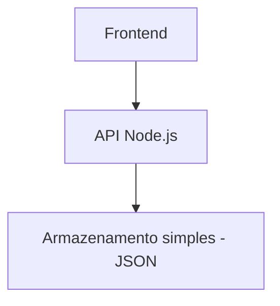
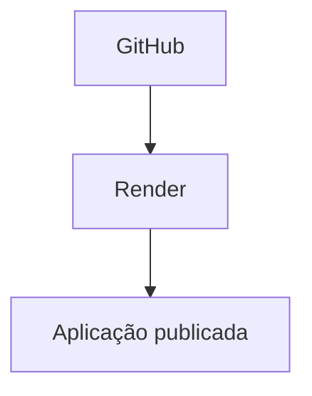

# AI Coding Dojo

Este repositório contém o material do **AI Coding Dojo**, um treinamento prático sobre **como utilizar Inteligência Artificial como assistente no desenvolvimento de software**.

O objetivo do dojo é demonstrar **como programar com apoio de IA mantendo controle técnico sobre o código**, evitando problemas comuns como:

- código gerado sem entendimento
- aumento de complexidade cognitiva
- dependência excessiva de IA
- perda de qualidade de software

Durante o dojo será desenvolvido um projeto pequeno enquanto aprendemos **como solicitar código para IA, revisar o que foi gerado e refatorar quando necessário**.

---

# Objetivo do Dojo

Ensinar na prática:

- como estruturar prompts para desenvolvimento
- como dividir problemas em tarefas menores
- como revisar código gerado por IA
- como manter simplicidade no código
- como usar IA como ferramenta e não como substituto do raciocínio técnico

---

# Projeto do Dojo

Durante o dojo construiremos um **Encurtador de URL simples**.

A aplicação permitirá transformar links longos em links curtos que redirecionam para o endereço original.

Exemplo:

https://meuapp.dev/a3k92  
→ redireciona para  
https://www.exemplo.com/artigo-muito-longo-com-parametros?id=123

Funcionalidades:

- criar URL encurtada
- redirecionar para URL original
- listar URLs criadas
- contador de acessos

O projeto foi escolhido porque é **simples, pequeno e fácil de compreender**, mas permite demonstrar várias práticas de desenvolvimento com IA.

---

# Tecnologias

Backend

- Node.js
- Express

Frontend

- HTML5
- JavaScript
- Tailwind CSS

Armazenamento

- JSON local (arquivo simples)

A intenção é **manter a stack o mais simples possível**, para focar no processo de desenvolvimento com IA.

---

# Arquitetura



---

# Hospedagem

A aplicação será publicada utilizando **Render**.

O Render permite hospedar aplicações Node.js diretamente a partir de um repositório GitHub, com deploy automático e HTTPS configurado automaticamente.

Fluxo de deploy:



Isso permitirá demonstrar no dojo:

- deploy simples de aplicações web
- integração com GitHub
- atualização automática a cada commit

---

# Estrutura do repositório

```plain
ai-coding-dojo
.github/workflow/deploy.yml
.ai/
backend/
frontend/
docs/
prompts/
```

backend  
API responsável por gerar URLs curtas e redirecionar para o destino.

frontend  
Interface web simples para criar e visualizar URLs.

docs  
Material de apoio do dojo.

prompts  
Prompts utilizados durante o treinamento.

---

# Regras do Dojo

Durante o treinamento seguiremos algumas regras:

1. Nunca aceitar código gerado por IA sem compreender.
2. Sempre revisar e validar o código gerado.
3. Preferir soluções simples.
4. Evitar abstrações desnecessárias.
5. Refatorar sempre que a complexidade aumentar.

---

# Resultado esperado

Ao final do dojo os participantes deverão entender:

- como usar IA para acelerar desenvolvimento
- como manter qualidade de código mesmo utilizando IA
- como revisar e melhorar código gerado
- como integrar IA ao fluxo real de desenvolvimento
