# Integração API ↔ Frontend

Este documento descreve como o **Frontend** e a **API** do projeto Encurtador de URL se integram.

---

## ✅ Status de Compatibilidade

**100% Compatível** - API e Frontend estão completamente alinhados.

---

## Visão Geral da Integração

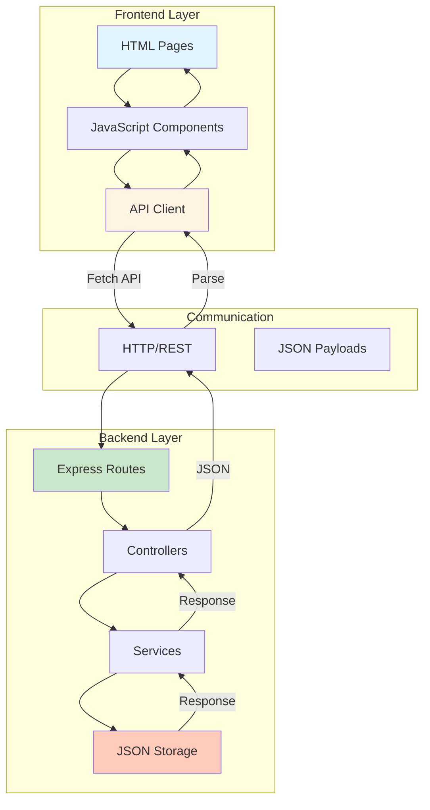

---

## Mapeamento de Funcionalidades

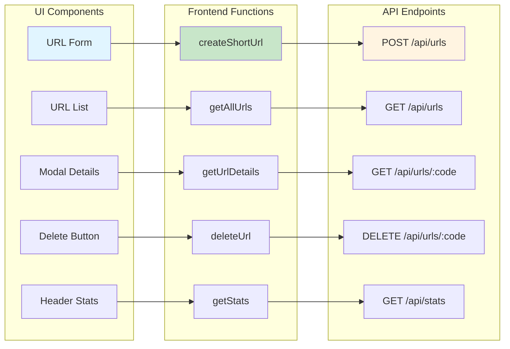

---

### 1. Criar URL Encurtada

**Frontend:**
```javascript
// Função: createShortUrl(originalUrl, customCode = null)
const response = await fetch('http://localhost:3000/api/urls', {
  method: 'POST',
  headers: { 'Content-Type': 'application/json' },
  body: JSON.stringify({
    originalUrl: 'https://www.exemplo.com/artigo-longo',
    customCode: 'meulink' // opcional
  })
});
```

**API:**
- **Endpoint:** `POST /api/urls`
- **Request Body:** `{ originalUrl: string, customCode?: string }`
- **Response:** `201 Created`

```json
{
  "id": "a3k92",
  "code": "a3k92",
  "originalUrl": "https://www.exemplo.com/artigo-longo",
  "shortUrl": "http://localhost:3000/a3k92",
  "clicks": 0,
  "createdAt": "2024-01-15T10:30:00.000Z"
}
```

**Componente:** `URL Form Component` → `Result Card Component`

---

### 2. Listar URLs

**Frontend:**
```javascript
// Função: getAllUrls(limit = 50, offset = 0)
const response = await fetch('http://localhost:3000/api/urls?limit=10&offset=0');
const data = await response.json();
```

**API:**
- **Endpoint:** `GET /api/urls`
- **Query Params:** `limit`, `offset`
- **Response:** `200 OK`

```json
{
  "total": 150,
  "limit": 10,
  "offset": 0,
  "data": [
    {
      "id": "a3k92",
      "code": "a3k92",
      "originalUrl": "https://www.exemplo.com/artigo-longo",
      "shortUrl": "http://localhost:3000/a3k92",
      "clicks": 42,
      "createdAt": "2024-01-15T10:30:00.000Z"
    }
  ]
}
```

**Componente:** `URL List Component` → `URL Item Component` (para cada item)

---

### 3. Obter Detalhes de URL

**Frontend:**
```javascript
// Função: getUrlDetails(code)
const response = await fetch(`http://localhost:3000/api/urls/${code}`);
const data = await response.json();
```

**API:**
- **Endpoint:** `GET /api/urls/:code`
- **Response:** `200 OK`

```json
{
  "id": "a3k92",
  "code": "a3k92",
  "originalUrl": "https://www.exemplo.com/artigo-longo",
  "shortUrl": "http://localhost:3000/a3k92",
  "clicks": 42,
  "createdAt": "2024-01-15T10:30:00.000Z"
}
```

**Componente:** `Modal Component` (exibe detalhes)

---

### 4. Deletar URL

**Frontend:**
```javascript
// Função: deleteUrl(code)
const response = await fetch(`http://localhost:3000/api/urls/${code}`, {
  method: 'DELETE'
});
```

**API:**
- **Endpoint:** `DELETE /api/urls/:code`
- **Response:** `200 OK`

```json
{
  "message": "URL deletada com sucesso",
  "code": "a3k92"
}
```

**Componente:** `URL Item Component` → Botão Deletar → Confirmação

---

### 5. Estatísticas

**Frontend:**
```javascript
// Função: getStats()
const response = await fetch('http://localhost:3000/api/stats');
const data = await response.json();
```

**API:**
- **Endpoint:** `GET /api/stats`
- **Response:** `200 OK`

```json
{
  "totalUrls": 150,
  "totalClicks": 3542,
  "topUrls": [
    {
      "code": "a3k92",
      "originalUrl": "https://www.exemplo.com/artigo-longo",
      "clicks": 342
    }
  ]
}
```

**Componente:** `Header Component` (exibe estatísticas)

---

### 6. Redirecionar

**Frontend:**
```javascript
// Link direto na lista
<a href="${shortUrl}" target="_blank">${shortUrl}</a>
```

**API:**
- **Endpoint:** `GET /:code`
- **Response:** `302 Found` (redirect para URL original)
- **Side Effect:** Incrementa contador de cliques

**Componente:** `URL Item Component` → Link clicável

---

## Estrutura de Dados Compartilhada

### URL Object

Tanto API quanto Frontend usam a mesma estrutura:

```typescript
interface UrlObject {
  id: string;           // Mesmo valor que 'code' - identificador único
  code: string;         // Código da URL encurtada (ex: "a3k92")
  originalUrl: string;  // URL original completa
  shortUrl: string;     // URL curta completa (ex: "http://localhost:3000/a3k92")
  clicks: number;       // Contador de acessos
  createdAt: string;    // ISO 8601 timestamp
}
```

---

## Fluxo Completo: Criar URL

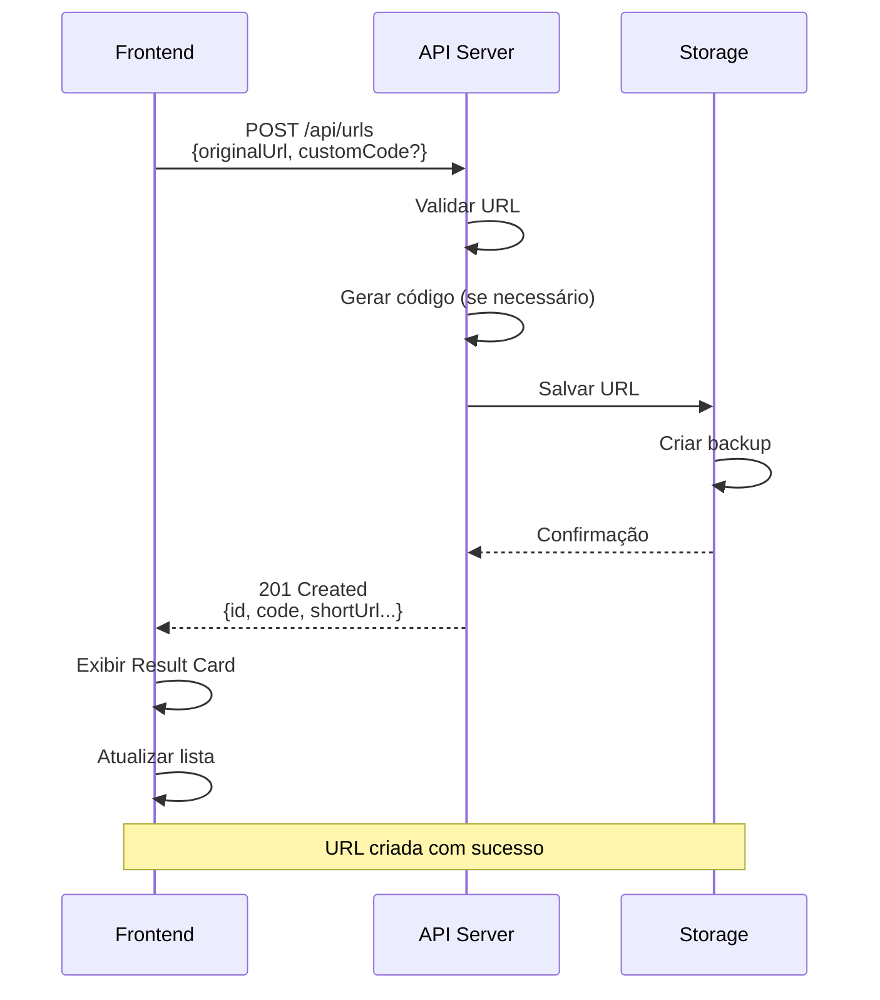

---

## Fluxo Completo: Redirecionar

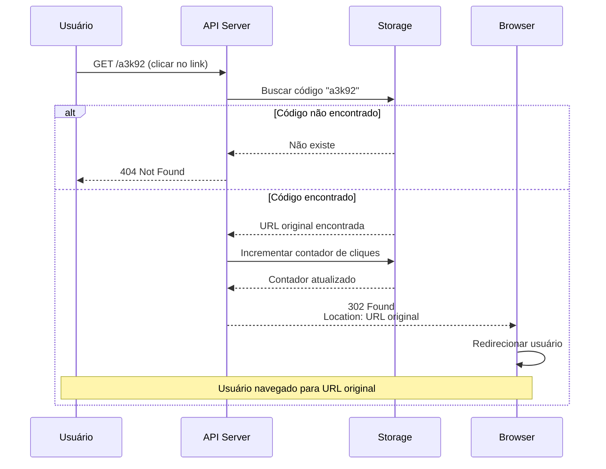

---

## Tratamento de Erros

### Fluxo de Tratamento de Erros

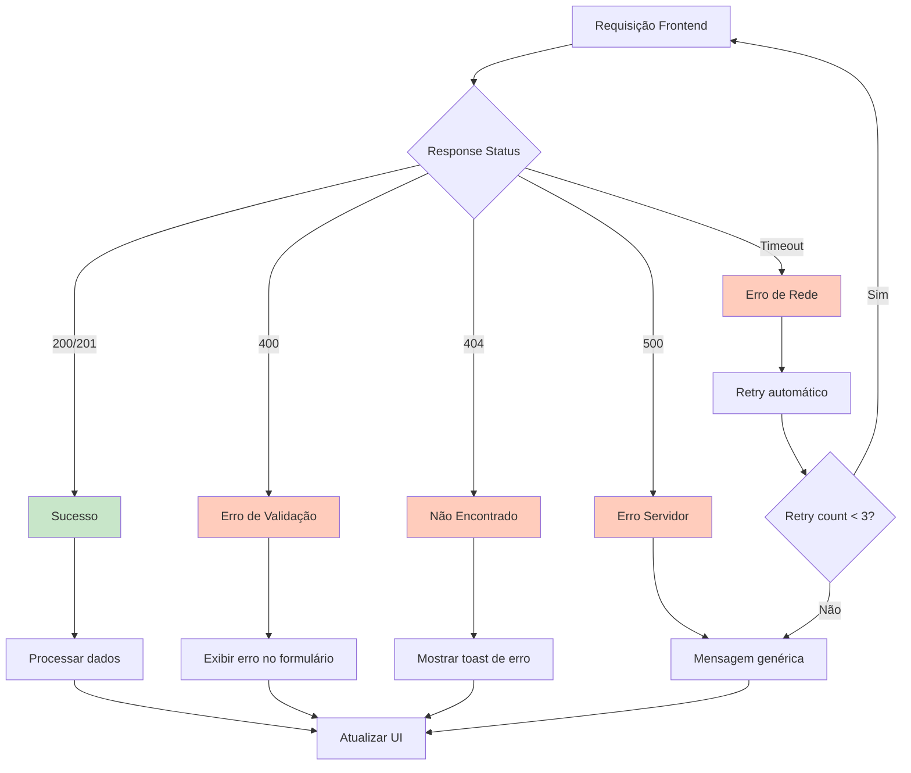

### Frontend → API

| Erro API | Status | Ação Frontend |
|----------|--------|---------------|
| URL inválida | 400 | Exibir erro no formulário |
| Código duplicado | 400 | Sugerir outro código |
| URL não encontrada | 404 | Exibir toast de erro |
| Erro servidor | 500 | Exibir mensagem genérica |
| Timeout | - | Retry automático |

### Implementação no Frontend

```javascript
async function createShortUrl(originalUrl, customCode = null) {
  try {
    const response = await fetch('http://localhost:3000/api/urls', {
      method: 'POST',
      headers: { 'Content-Type': 'application/json' },
      body: JSON.stringify({ originalUrl, customCode })
    });

    if (!response.ok) {
      const error = await response.json();
      
      if (response.status === 400) {
        // Validação - exibir no formulário
        showFormError(error.message);
      } else if (response.status === 404) {
        // Não encontrado - toast
        showToast('Recurso não encontrado', 'error');
      } else {
        // Erro genérico
        showToast('Erro ao criar URL. Tente novamente.', 'error');
      }
      
      return null;
    }

    const data = await response.json();
    return data;
    
  } catch (error) {
    // Erro de rede ou timeout
    showToast('Erro de conexão. Verifique sua internet.', 'error');
    return null;
  }
}
```

---

## Validações Sincronizadas

### Diagrama de Validação

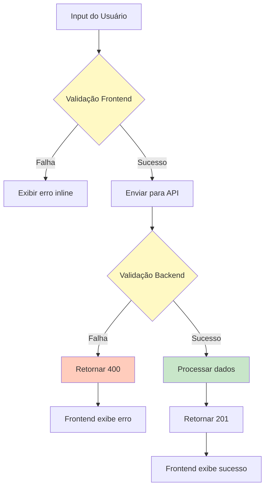

### Código Personalizado

**Frontend (JavaScript):**
```javascript
function isValidCustomCode(code) {
  const pattern = /^[a-zA-Z0-9-]{3,20}$/;
  return pattern.test(code);
}
```

**API (Backend):**
- Regex: `^[a-zA-Z0-9-]{3,20}$`
- Mesma validação

### URL Original

**Frontend (JavaScript):**
```javascript
function isValidUrl(url) {
  try {
    const parsed = new URL(url);
    return parsed.protocol === 'http:' || parsed.protocol === 'https:';
  } catch {
    return false;
  }
}
```

**API (Backend):**
- RFC 3986 compliant
- Deve começar com `http://` ou `https://`
- Máximo 2000 caracteres

---

## CORS Configuration

### Fluxo CORS

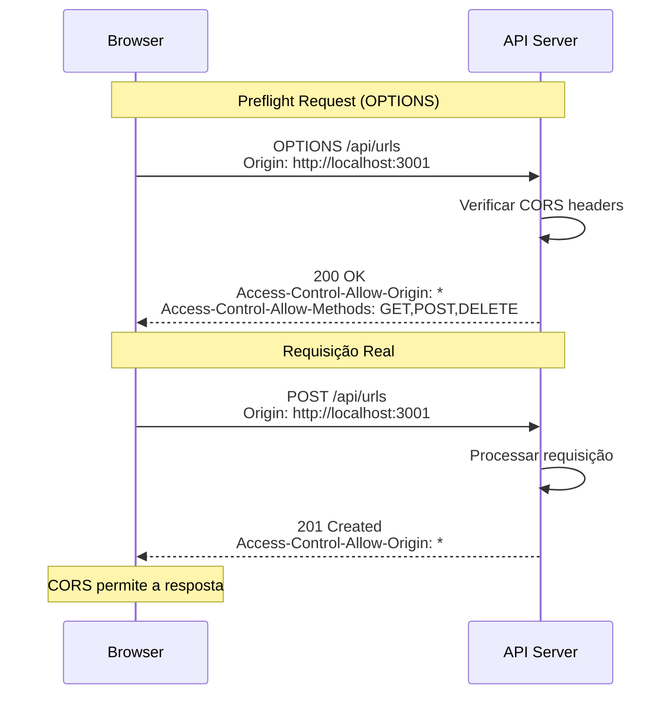

A API deve permitir requisições do frontend:

```javascript
// Backend - Express
app.use((req, res, next) => {
  res.header('Access-Control-Allow-Origin', '*');
  res.header('Access-Control-Allow-Methods', 'GET, POST, DELETE, OPTIONS');
  res.header('Access-Control-Allow-Headers', 'Content-Type');
  next();
});
```

---

## Configuração de Ambiente

### Diagrama de Ambientes

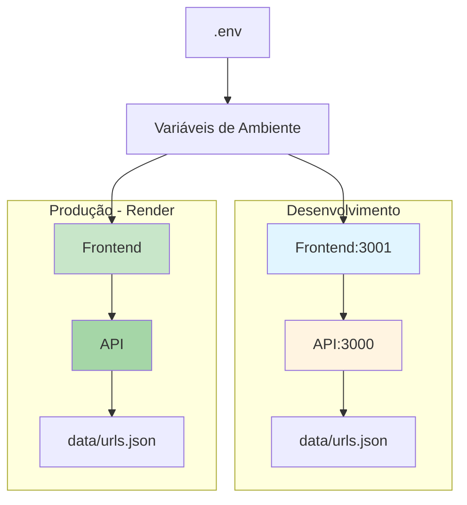

### Frontend

```javascript
// config.js
const API_BASE_URL = process.env.API_URL || 'http://localhost:3000';

export const API_ENDPOINTS = {
  createUrl: `${API_BASE_URL}/api/urls`,
  listUrls: `${API_BASE_URL}/api/urls`,
  getUrl: (code) => `${API_BASE_URL}/api/urls/${code}`,
  deleteUrl: (code) => `${API_BASE_URL}/api/urls/${code}`,
  stats: `${API_BASE_URL}/api/stats`,
  redirect: (code) => `${API_BASE_URL}/${code}`
};
```

### Produção (Render)

```bash
# Variável de ambiente
API_URL=https://seu-app.onrender.com
```

---

## Performance

### Arquitetura de Cache

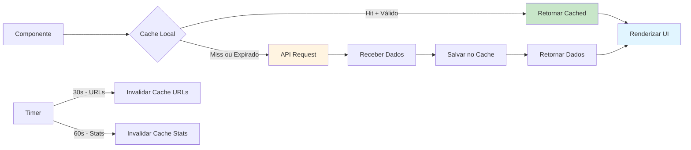

### Cache Strategy

1. **Lista de URLs**: Cache de 30 segundos
2. **Estatísticas**: Cache de 1 minuto
3. **Detalhes**: Sem cache (sempre fresh)

```javascript
const cache = new Map();

async function getAllUrlsWithCache(limit = 50, offset = 0) {
  const cacheKey = `urls_${limit}_${offset}`;
  const cached = cache.get(cacheKey);
  
  if (cached && Date.now() - cached.timestamp < 30000) {
    return cached.data;
  }
  
  const data = await getAllUrls(limit, offset);
  cache.set(cacheKey, { data, timestamp: Date.now() });
  
  return data;
}
```

---

## Testes de Integração

### Fluxo de Testes

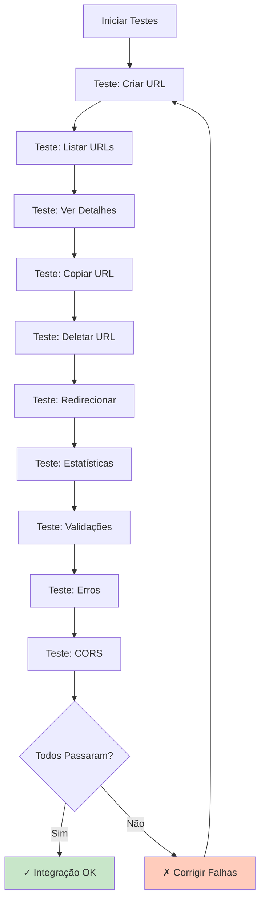

### Checklist

- [ ] Frontend consegue criar URL via API
- [ ] Lista de URLs é carregada corretamente
- [ ] Paginação funciona (limit/offset)
- [ ] Detalhes são exibidos corretamente
- [ ] Deletar remove do frontend e backend
- [ ] Erros da API são tratados no frontend
- [ ] Redirecionamento incrementa contador
- [ ] Estatísticas são atualizadas
- [ ] CORS está configurado corretamente
- [ ] Validações são consistentes

---

## Próximos Passos

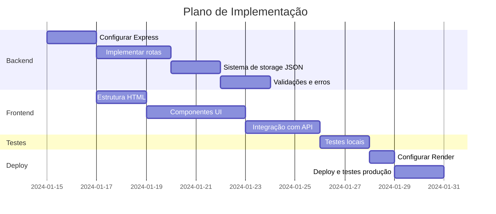

### Etapas

1. Implementar API backend seguindo a documentação
2. Implementar frontend seguindo a documentação
3. Testar integração localmente
4. Configurar variáveis de ambiente
5. Deploy no Render
6. Testes end-to-end em produção

---

## Matriz de Compatibilidade

```mermaid
graph TB
    subgraph "Request Structure"
        R1[Frontend Request]
        R2[API Expected]
        R3[✓ Match]
    end
    
    subgraph "Response Structure"
        S1[API Response]
        S2[Frontend Expected]
        S3[✓ Match]
    end
    
    subgraph "Data Types"
        D1[Frontend Types]
        D2[API Types]
        D3[✓ Match]
    end
    
    subgraph "Error Handling"
        E1[Frontend Errors]
        E2[API Errors]
        E3[✓ Match]
    end
    
    R1 --> R2
    R2 --> R3
    
    S1 --> S2
    S2 --> S3
    
    D1 --> D2
    D2 --> D3
    
    E1 --> E2
    E2 --> E3
    
    style R3 fill:#c8e6c9
    style S3 fill:#c8e6c9
    style D3 fill:#c8e6c9
    style E3 fill:#c8e6c9
```

### Checklist de Compatibilidade

| Feature | Frontend | Backend | Status |
|---------|----------|---------|--------|
| Criar URL | createShortUrl() | POST /api/urls | ✅ |
| Listar URLs | getAllUrls() | GET /api/urls | ✅ |
| Ver Detalhes | getUrlDetails() | GET /api/urls/:code | ✅ |
| Deletar | deleteUrl() | DELETE /api/urls/:code | ✅ |
| Estatísticas | getStats() | GET /api/stats | ✅ |
| Redirecionar | Link direto | GET /:code | ✅ |
| Paginação | limit/offset params | Query params | ✅ |
| Validações | Regex client-side | Regex server-side | ✅ |
| Códigos HTTP | Tratamento de erros | Status codes | ✅ |
| CORS | Fetch com credenciais | Headers configurados | ✅ |

---

## Diagrama de Integração Completo

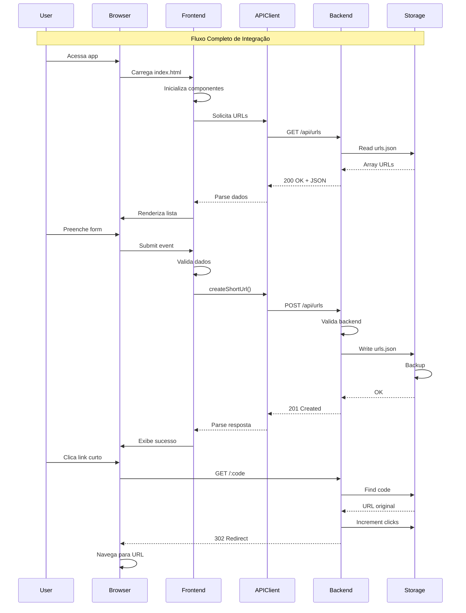

---

## Referências

- [Documentação da API](./api/README.md)
- [Documentação do Frontend](./frontend/README.md)
- [Documentação de Arquitetura](./ARCHITECTURE.md)
- [README Principal](../README.md)