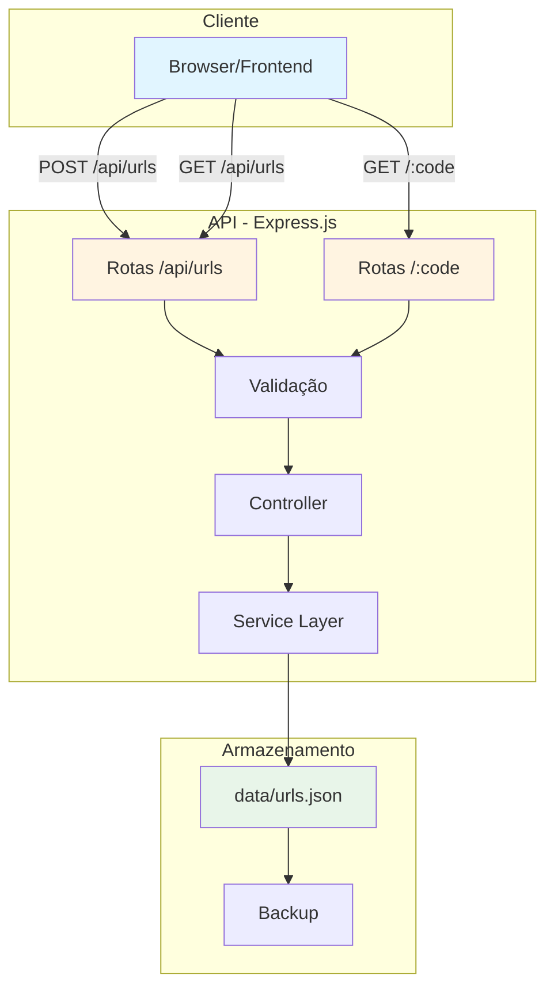
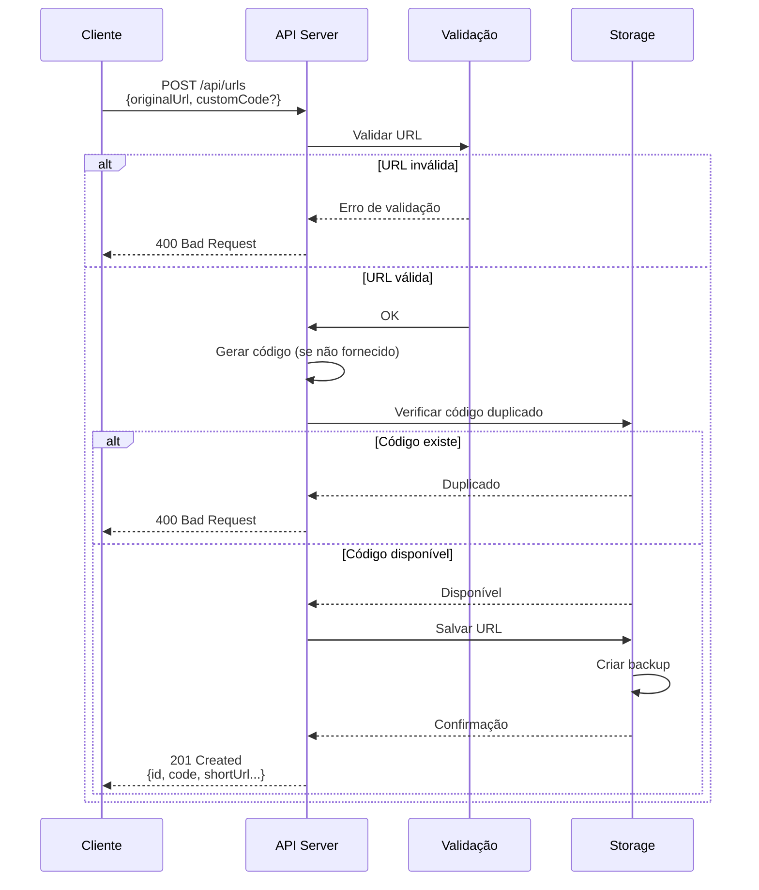
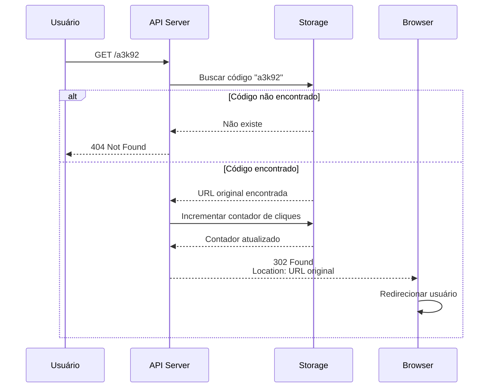
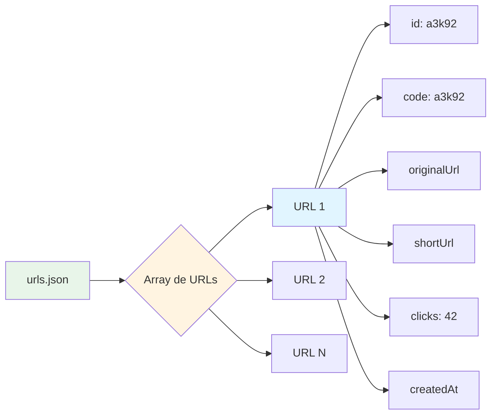
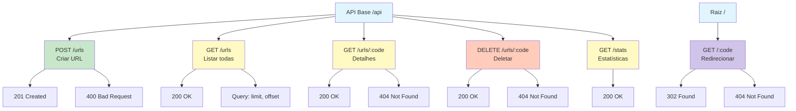
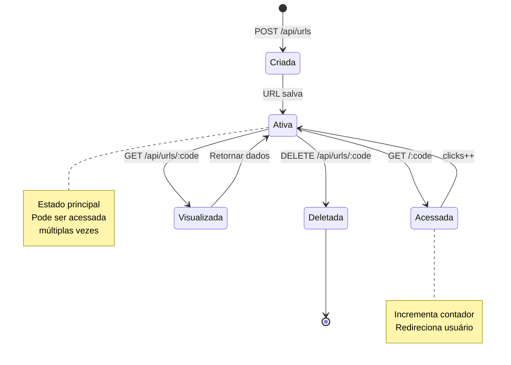
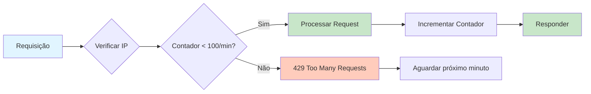

# API Documentation - Encurtador de URL

Esta é a documentação da API REST do projeto **Encurtador de URL** desenvolvido no AI Coding Dojo.

---

## Base URL

```
http://localhost:3000/api
```

Em produção (Render):
```
https://seu-app.onrender.com/api
```

---

## Arquitetura da API



---

## Endpoints

### 1. Criar URL Encurtada

Cria uma nova URL encurtada a partir de uma URL longa.

**Endpoint:** `POST /api/urls`

**Request Body:**
```json
{
  "originalUrl": "https://www.exemplo.com/artigo-muito-longo-com-parametros?id=123&category=tech",
  "customCode": "meulink"
}
```

**Campos:**
- `originalUrl` (string, obrigatório): URL original que será encurtada
- `customCode` (string, opcional): Código personalizado para a URL curta. Se não informado, será gerado automaticamente.

**Response:** `201 Created`
```json
{
  "id": "a3k92",
  "originalUrl": "https://www.exemplo.com/artigo-muito-longo-com-parametros?id=123&category=tech",
  "shortUrl": "http://localhost:3000/a3k92",
  "code": "a3k92",
  "clicks": 0,
  "createdAt": "2024-01-15T10:30:00.000Z"
}
```

**Observação:** O campo `id` é o mesmo valor do campo `code` e serve como identificador único da URL encurtada.

**Erros:**
- `400 Bad Request`: URL inválida ou código personalizado já existe
- `500 Internal Server Error`: Erro no servidor

---

### 2. Redirecionar para URL Original

Redireciona para a URL original e incrementa o contador de acessos.

**Endpoint:** `GET /:code`

**Parâmetros:**
- `code` (string): Código da URL encurtada

**Exemplo:**
```
GET /a3k92
```

**Response:** `302 Found`
- Redireciona automaticamente para a URL original
- Header `Location` contém a URL de destino

**Erros:**
- `404 Not Found`: Código não encontrado

---

### 3. Obter Detalhes de uma URL

Retorna informações detalhadas sobre uma URL encurtada.

**Endpoint:** `GET /api/urls/:code`

**Parâmetros:**
- `code` (string): Código da URL encurtada

**Exemplo:**
```
GET /api/urls/a3k92
```

**Response:** `200 OK`
```json
{
  "id": "a3k92",
  "originalUrl": "https://www.exemplo.com/artigo-muito-longo-com-parametros?id=123&category=tech",
  "shortUrl": "http://localhost:3000/a3k92",
  "code": "a3k92",
  "clicks": 42,
  "createdAt": "2024-01-15T10:30:00.000Z"
}
```

**Erros:**
- `404 Not Found`: Código não encontrado

---

### 4. Listar Todas as URLs

Lista todas as URLs encurtadas criadas, ordenadas por data de criação (mais recentes primeiro).

**Endpoint:** `GET /api/urls`

**Query Parameters:**
- `limit` (number, opcional): Número máximo de resultados (padrão: 50)
- `offset` (number, opcional): Número de registros para pular (padrão: 0)

**Exemplo:**
```
GET /api/urls?limit=10&offset=0
```

**Response:** `200 OK`
```json
{
  "total": 150,
  "limit": 10,
  "offset": 0,
  "data": [
    {
      "id": "a3k92",
      "originalUrl": "https://www.exemplo.com/artigo-longo",
      "shortUrl": "http://localhost:3000/a3k92",
      "code": "a3k92",
      "clicks": 42,
      "createdAt": "2024-01-15T10:30:00.000Z"
    },
    {
      "id": "b7x45",
      "originalUrl": "https://www.outroexemplo.com/pagina",
      "shortUrl": "http://localhost:3000/b7x45",
      "code": "b7x45",
      "clicks": 15,
      "createdAt": "2024-01-14T15:20:00.000Z"
    }
  ]
}
```

---

### 5. Deletar URL

Remove uma URL encurtada do sistema.

**Endpoint:** `DELETE /api/urls/:code`

**Parâmetros:**
- `code` (string): Código da URL encurtada

**Exemplo:**
```
DELETE /api/urls/a3k92
```

**Response:** `200 OK`
```json
{
  "message": "URL deletada com sucesso",
  "code": "a3k92"
}
```

**Erros:**
- `404 Not Found`: Código não encontrado

---

### 6. Estatísticas Gerais

Retorna estatísticas gerais do sistema.

**Endpoint:** `GET /api/stats`

**Response:** `200 OK`
```json
{
  "totalUrls": 150,
  "totalClicks": 3542,
  "topUrls": [
    {
      "code": "a3k92",
      "originalUrl": "https://www.exemplo.com/artigo-longo",
      "clicks": 342
    },
    {
      "code": "b7x45",
      "originalUrl": "https://www.outroexemplo.com/pagina",
      "clicks": 215
    }
  ]
}
```

---

## Fluxo de Criação de URL



## Fluxo de Redirecionamento



---

## Regras de Negócio

### Geração de Códigos

- Códigos personalizados devem ter entre 3 e 20 caracteres
- Apenas letras, números e hífens são permitidos
- Códigos automáticos são gerados com 5 caracteres alfanuméricos

### Validação de URLs

- URLs devem começar com `http://` ou `https://`
- URLs devem ser válidas segundo o padrão RFC 3986
- URLs muito longas (> 2000 caracteres) serão rejeitadas

### Armazenamento

- Dados são armazenados em arquivo JSON local (`data/urls.json`)
- Backup automático é realizado a cada modificação

#### Estrutura do Arquivo JSON



---

## Exemplos de Uso

### cURL

**Criar URL encurtada:**
```bash
curl -X POST http://localhost:3000/api/urls \
  -H "Content-Type: application/json" \
  -d '{
    "originalUrl": "https://www.exemplo.com/artigo-longo"
  }'
```

**Listar URLs:**
```bash
curl http://localhost:3000/api/urls
```

**Obter detalhes:**
```bash
curl http://localhost:3000/api/urls/a3k92
```

### JavaScript (Fetch API)

```javascript
// Criar URL encurtada
const response = await fetch('http://localhost:3000/api/urls', {
  method: 'POST',
  headers: {
    'Content-Type': 'application/json'
  },
  body: JSON.stringify({
    originalUrl: 'https://www.exemplo.com/artigo-longo',
    customCode: 'meulink'
  })
});

const data = await response.json();
console.log('URL curta criada:', data.shortUrl);
```

---

## Mapa de Endpoints



---

## Códigos de Status HTTP

| Código | Descrição |
|--------|-----------|
| 200 | Sucesso |
| 201 | Recurso criado com sucesso |
| 302 | Redirecionamento |
| 400 | Requisição inválida |
| 404 | Recurso não encontrado |
| 500 | Erro interno do servidor |

---

## Headers

### Request Headers

```
Content-Type: application/json
```

### Response Headers

```
Content-Type: application/json
Access-Control-Allow-Origin: *
```

---

## Ciclo de Vida de uma URL



---

## Limitações

- Máximo de 1000 URLs por instância (limite do armazenamento JSON)
- Rate limit: 100 requisições por minuto por IP
- Tamanho máximo do payload: 1MB

---

## Rate Limiting



---

## Próximas Versões

Funcionalidades planejadas:

- [ ] Autenticação de usuários
- [ ] Expiração de URLs
- [ ] Analytics detalhados (geolocalização, device, etc)
- [ ] QR Code para URLs
- [ ] Histórico de acessos
- [ ] Proteção por senha
- [ ] API Keys para integração

---

## Suporte

Para dúvidas ou problemas, consulte o [README principal](../../README.md) do projeto ou abra uma issue no repositório.