# Frontend Documentation - Encurtador de URL

Esta é a documentação do frontend do projeto **Encurtador de URL** desenvolvido no AI Coding Dojo.

---

## Tecnologias

- **HTML5**: Estrutura semântica
- **JavaScript (Vanilla)**: Interatividade sem frameworks
- **Tailwind CSS**: Estilização responsiva
- **Fetch API**: Comunicação com backend

---

## Estrutura de Arquivos

```
frontend/
├── index.html              # Página principal
├── assets/
│   ├── css/
│   │   └── styles.css      # Estilos customizados
│   ├── js/
│   │   ├── app.js          # Lógica principal
│   │   ├── api.js          # Comunicação com API
│   │   └── components.js   # Componentes reutilizáveis
│   └── images/
│       └── logo.svg        # Logo da aplicação
└── README.md
```

### Diagrama de Arquitetura

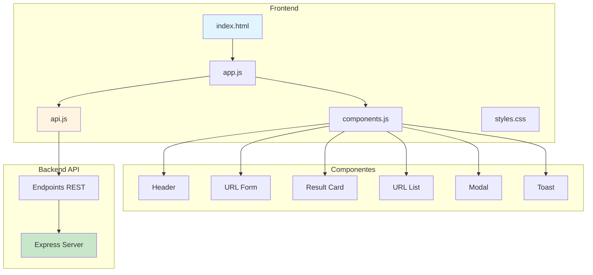

---

## Páginas

### 1. Página Principal (index.html)

**URL:** `/`

**Descrição:**
Página única (SPA simplificada) que contém todas as funcionalidades da aplicação.

**Seções:**
- Header com logo e título
- Formulário de criação de URL
- Lista de URLs criadas
- Rodapé com informações

**Layout Wireframe:**

```mermaid
graph TB
    subgraph "Página Principal - Wireframe"
        A[Header Component]
        B[URL Form Component]
        C[Result Card Component]
        D[URL List Component]
        E[Footer Component]
    end
    
    A --> |Logo + Estatísticas| A1[🔗 Encurtador de URL | 150 URLs criadas]
    
    B --> |Campos de Input| B1[Input: URL Original<br/>Input: Código Customizado opcional<br/>Button: Encurtar URL]
    
    C --> |Exibido após criar| C1[✓ URL encurtada com sucesso!<br/>📋 http://localhost:3000/a3k92<br/>Buttons: Copiar, QR Code]
    
    D --> |Lista de URLs| D1[URL Item 1: a3k92<br/>URL Item 2: b7x45<br/>URL Item N...]
    
    D1 --> |Cada item contém| D2[Code Badge<br/>Original URL Link<br/>👁 Cliques + 📅 Data<br/>Buttons: Copiar, Detalhes, Deletar]
    
    E --> |Rodapé| E1[AI Coding Dojo © 2024]
    
    style A fill:#e1f5ff
    style B fill:#c8e6c9
    style C fill:#fff9c4
    style D fill:#ffccbc
    style E fill:#d1c4e9
```

**Layout Visual ASCII:**
```
┌─────────────────────────────────────────┐
│           HEADER                        │
│  [Logo] Encurtador de URL               │
└─────────────────────────────────────────┘
┌─────────────────────────────────────────┐
│     FORMULÁRIO DE CRIAÇÃO               │
│  ┌─────────────────────────────────┐   │
│  │ Cole sua URL aqui...            │   │
│  └─────────────────────────────────┘   │
│  ┌─────────────────────────────────┐   │
│  │ Código personalizado (opcional) │   │
│  └─────────────────────────────────┘   │
│  [Encurtar URL]                         │
└─────────────────────────────────────────┘
┌─────────────────────────────────────────┐
│     RESULTADO (quando criado)           │
│  ✓ URL encurtada com sucesso!           │
│  📋 http://localhost:3000/a3k92         │
│  [Copiar] [Visualizar QR Code]          │
└─────────────────────────────────────────┘
┌─────────────────────────────────────────┐
│     LISTA DE URLs                       │
│  ┌───────────────────────────────────┐ │
│  │ a3k92                             │ │
│  │ exemplo.com/artigo-longo          │ │
│  │ 👁 42 cliques | 📅 15/01/2024     │ │
│  │ [Copiar] [Detalhes] [Deletar]     │ │
│  └───────────────────────────────────┘ │
│  ┌───────────────────────────────────┐ │
│  │ b7x45                             │ │
│  │ outrosite.com/pagina              │ │
│  │ 👁 15 cliques | 📅 14/01/2024     │ │
│  │ [Copiar] [Detalhes] [Deletar]     │ │
│  └───────────────────────────────────┘ │
└─────────────────────────────────────────┘
┌─────────────────────────────────────────┐
│           FOOTER                        │
│  AI Coding Dojo © 2024                  │
└─────────────────────────────────────────┘
```

---

## Componentes

### Hierarquia de Componentes

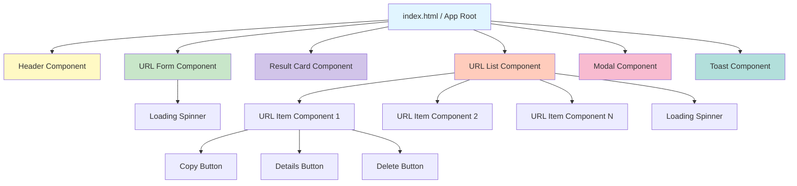

---

### 1. Header Component

**Arquivo:** `components.js` - `createHeader()`

**Descrição:**
Cabeçalho da aplicação com logo e título.

**Propriedades:**
- Logo (imagem ou emoji)
- Título da aplicação
- Estatísticas rápidas (opcional)

**HTML:**
```html
<header class="bg-blue-600 text-white py-6 shadow-lg">
  <div class="container mx-auto px-4">
    <div class="flex items-center justify-between">
      <div class="flex items-center space-x-3">
        <span class="text-4xl">🔗</span>
        <h1 class="text-3xl font-bold">Encurtador de URL</h1>
      </div>
      <div class="text-sm">
        <span id="stats-total">0 URLs criadas</span>
      </div>
    </div>
  </div>
</header>
```

**Responsabilidades:**
- Exibir branding da aplicação
- Mostrar estatísticas gerais
- Responsivo em mobile

---

### 2. URL Form Component

**Arquivo:** `components.js` - `createUrlForm()`

**Descrição:**
Formulário para criar novas URLs encurtadas.

**Campos:**
- `originalUrl` (input text, obrigatório): URL a ser encurtada
- `customCode` (input text, opcional): Código personalizado

**Validações:**
- URL deve ser válida (http/https)
- Código personalizado: 3-20 caracteres, apenas alfanuméricos e hífens
- Feedback visual de erros

**HTML:**
```html
<div class="bg-white rounded-lg shadow-md p-6 mb-6">
  <form id="url-form">
    <div class="mb-4">
      <label class="block text-gray-700 font-semibold mb-2">
        Cole sua URL aqui
      </label>
      <input 
        type="url" 
        id="original-url" 
        placeholder="https://www.exemplo.com/artigo-muito-longo"
        class="w-full px-4 py-3 border border-gray-300 rounded-lg focus:ring-2 focus:ring-blue-500 focus:border-transparent"
        required
      />
    </div>
    
    <div class="mb-4">
      <label class="block text-gray-700 font-semibold mb-2">
        Código personalizado (opcional)
      </label>
      <input 
        type="text" 
        id="custom-code" 
        placeholder="meulink"
        pattern="[a-zA-Z0-9-]{3,20}"
        class="w-full px-4 py-3 border border-gray-300 rounded-lg focus:ring-2 focus:ring-blue-500 focus:border-transparent"
      />
      <p class="text-sm text-gray-500 mt-1">
        3-20 caracteres: letras, números e hífens
      </p>
    </div>
    
    <button 
      type="submit"
      class="w-full bg-blue-600 text-white py-3 rounded-lg font-semibold hover:bg-blue-700 transition duration-200"
    >
      🚀 Encurtar URL
    </button>
  </form>
  
  <div id="form-error" class="hidden mt-4 p-3 bg-red-100 text-red-700 rounded-lg">
    <!-- Mensagem de erro aparece aqui -->
  </div>
</div>
```

**Eventos:**
- `submit`: Envia dados para API
- Validação em tempo real nos campos
- Loading state durante requisição

---

### 3. Result Card Component

**Arquivo:** `components.js` - `createResultCard(data)`

**Descrição:**
Card que exibe a URL encurtada após criação bem-sucedida.

**Parâmetros:**
```javascript
{
  code: "a3k92",
  shortUrl: "http://localhost:3000/a3k92",
  originalUrl: "https://www.exemplo.com/artigo-longo"
}
```

**HTML:**
```html
<div class="bg-green-50 border-2 border-green-500 rounded-lg p-6 mb-6 animate-fade-in">
  <div class="flex items-center mb-3">
    <span class="text-2xl mr-2">✓</span>
    <h3 class="text-xl font-bold text-green-700">URL encurtada com sucesso!</h3>
  </div>
  
  <div class="bg-white rounded-lg p-4 mb-4">
    <p class="text-sm text-gray-600 mb-2">Sua URL curta:</p>
    <div class="flex items-center justify-between">
      <a 
        href="${shortUrl}" 
        target="_blank"
        class="text-blue-600 text-lg font-mono hover:underline"
      >
        ${shortUrl}
      </a>
      <button 
        class="copy-btn bg-blue-600 text-white px-4 py-2 rounded hover:bg-blue-700"
        data-url="${shortUrl}"
      >
        📋 Copiar
      </button>
    </div>
  </div>
  
  <div class="text-sm text-gray-600">
    <p>URL original: <span class="font-mono">${originalUrl}</span></p>
  </div>
</div>
```

**Funcionalidades:**
- Copiar URL para clipboard
- Link clicável para testar redirecionamento
- Animação de entrada
- Auto-ocultar após 10 segundos

---

### 4. URL List Component

**Arquivo:** `components.js` - `createUrlList(urls)`

**Descrição:**
Lista todas as URLs encurtadas criadas.

**Parâmetros:**
```javascript
[
  {
    code: "a3k92",
    originalUrl: "https://www.exemplo.com/artigo-longo",
    shortUrl: "http://localhost:3000/a3k92",
    clicks: 42,
    createdAt: "2024-01-15T10:30:00.000Z"
  }
]
```

**HTML:**
```html
<div class="bg-white rounded-lg shadow-md p-6">
  <h2 class="text-2xl font-bold mb-4 text-gray-800">
    📊 Suas URLs (${urls.length})
  </h2>
  
  <div id="url-list" class="space-y-4">
    <!-- URL items aqui -->
  </div>
  
  <div id="empty-state" class="text-center py-8 text-gray-500">
    <p class="text-lg">Nenhuma URL criada ainda</p>
    <p class="text-sm">Cole uma URL acima para começar!</p>
  </div>
</div>
```

**Estados:**
- Lista vazia (empty state)
- Carregando (skeleton loader)
- Lista populada

---

### 5. URL Item Component

**Arquivo:** `components.js` - `createUrlItem(url)`

**Descrição:**
Item individual na lista de URLs.

**HTML:**
```html
<div class="border border-gray-200 rounded-lg p-4 hover:shadow-md transition duration-200">
  <div class="flex items-start justify-between mb-3">
    <div class="flex-1">
      <div class="flex items-center space-x-2 mb-2">
        <span class="bg-blue-100 text-blue-800 px-3 py-1 rounded-full font-mono font-semibold">
          ${code}
        </span>
        <span class="text-xs text-gray-500">
          📅 ${formatDate(createdAt)}
        </span>
      </div>
      
      <a 
        href="${originalUrl}" 
        target="_blank"
        class="text-gray-700 hover:text-blue-600 break-all text-sm"
      >
        ${truncateUrl(originalUrl, 60)}
      </a>
    </div>
  </div>
  
  <div class="flex items-center justify-between">
    <div class="flex items-center space-x-4 text-sm text-gray-600">
      <span>👁 ${clicks} ${clicks === 1 ? 'clique' : 'cliques'}</span>
    </div>
    
    <div class="flex space-x-2">
      <button 
        class="copy-btn text-blue-600 hover:text-blue-800 px-3 py-1 rounded hover:bg-blue-50"
        data-url="${shortUrl}"
      >
        📋 Copiar
      </button>
      <button 
        class="details-btn text-green-600 hover:text-green-800 px-3 py-1 rounded hover:bg-green-50"
        data-code="${code}"
      >
        👁 Detalhes
      </button>
      <button 
        class="delete-btn text-red-600 hover:text-red-800 px-3 py-1 rounded hover:bg-red-50"
        data-code="${code}"
      >
        🗑 Deletar
      </button>
    </div>
  </div>
</div>
```

**Funcionalidades:**
- Copiar URL curta
- Ver detalhes (modal)
- Deletar URL (com confirmação)
- Animação de remoção

---

### 6. Modal Component

**Arquivo:** `components.js` - `createModal(title, content)`

**Descrição:**
Modal genérico para exibir informações detalhadas.

**HTML:**
```html
<div id="modal-overlay" class="fixed inset-0 bg-black bg-opacity-50 flex items-center justify-center z-50">
  <div class="bg-white rounded-lg shadow-xl max-w-lg w-full mx-4 animate-scale-in">
    <div class="flex items-center justify-between p-6 border-b">
      <h3 class="text-xl font-bold text-gray-800">${title}</h3>
      <button class="close-modal text-gray-400 hover:text-gray-600 text-2xl">
        ×
      </button>
    </div>
    
    <div class="p-6">
      ${content}
    </div>
    
    <div class="flex justify-end p-6 border-t">
      <button class="close-modal bg-gray-200 text-gray-700 px-4 py-2 rounded hover:bg-gray-300">
        Fechar
      </button>
    </div>
  </div>
</div>
```

**Uso:**
- Detalhes da URL
- Confirmação de deleção
- Mensagens de erro
- QR Code (futuro)

---

### 7. Toast Notification Component

**Arquivo:** `components.js` - `showToast(message, type)`

**Descrição:**
Notificação temporária para feedback de ações.

**Tipos:**
- `success`: Verde
- `error`: Vermelho
- `info`: Azul
- `warning`: Amarelo

**HTML:**
```html
<div class="fixed top-4 right-4 z-50 animate-slide-in">
  <div class="bg-${color}-500 text-white px-6 py-3 rounded-lg shadow-lg flex items-center space-x-3">
    <span class="text-xl">${icon}</span>
    <span>${message}</span>
  </div>
</div>
```

**Comportamento:**
- Auto-ocultar após 3 segundos
- Múltiplos toasts empilhados
- Animação de entrada/saída

---

### 8. Loading Spinner Component

**Arquivo:** `components.js` - `createLoader()`

**Descrição:**
Indicador de carregamento durante requisições.

**HTML:**
```html
<div class="flex items-center justify-center py-8">
  <div class="animate-spin rounded-full h-12 w-12 border-b-2 border-blue-600"></div>
</div>
```

**Uso:**
- Durante criação de URL
- Ao carregar lista
- Operações de delete

---

## Fluxos de Interação

### Fluxo 1: Criar URL Encurtada

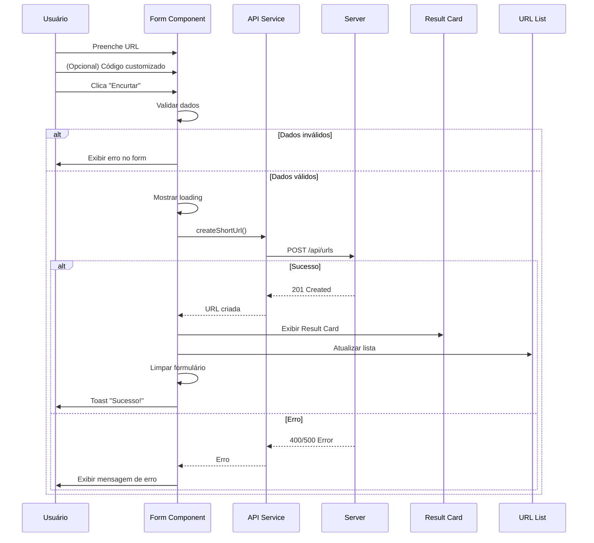

### Fluxo 2: Copiar URL

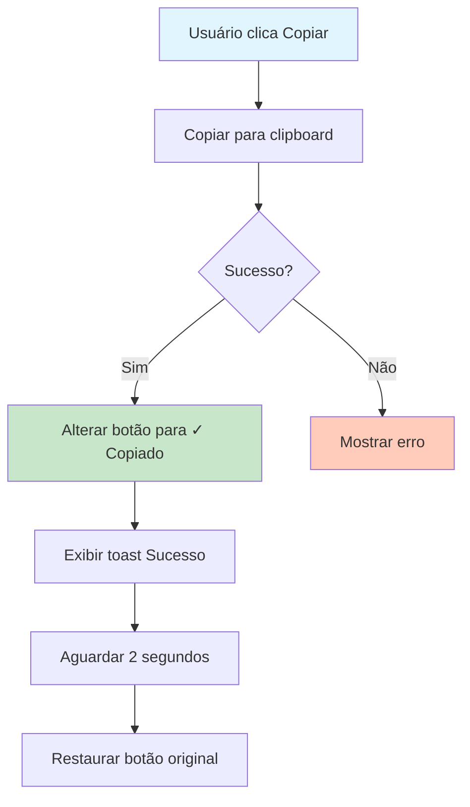

### Fluxo 3: Ver Detalhes

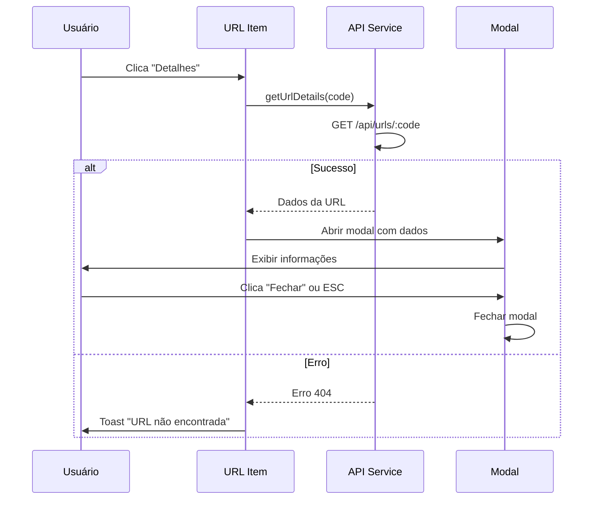

### Fluxo 4: Deletar URL

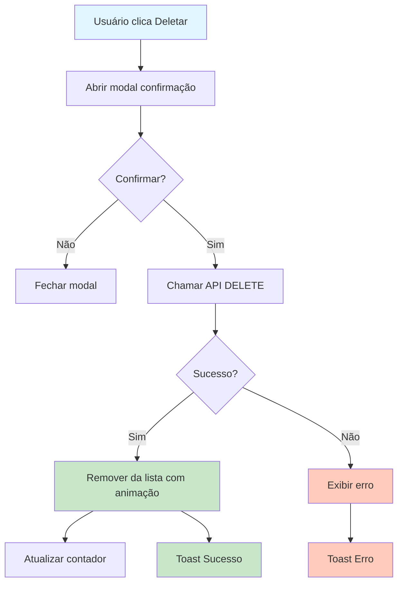

---

## Estados da Aplicação

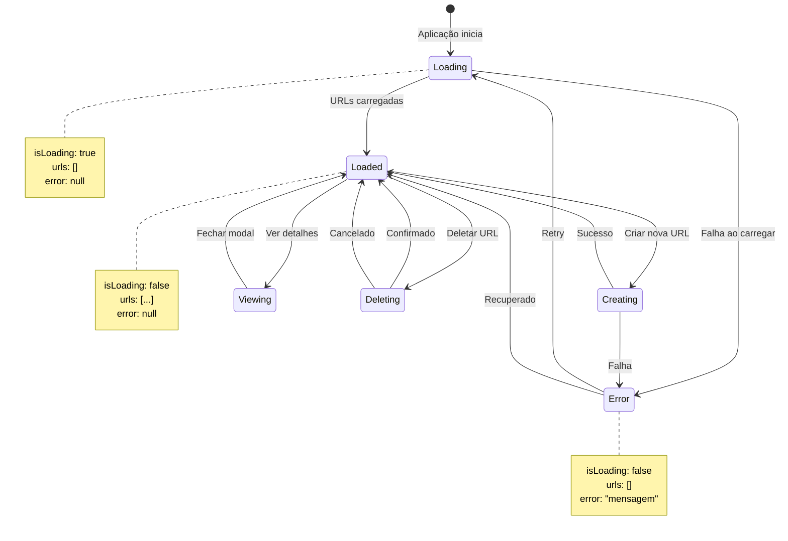

### Estado Inicial (Loading)
```javascript
{
  isLoading: true,
  urls: [],
  error: null
}
```

### Estado Carregado
```javascript
{
  isLoading: false,
  urls: [...],
  error: null
}
```

### Estado de Erro
```javascript
{
  isLoading: false,
  urls: [],
  error: "Mensagem de erro"
}
```

---

## Responsividade

### Breakpoints (Tailwind CSS)

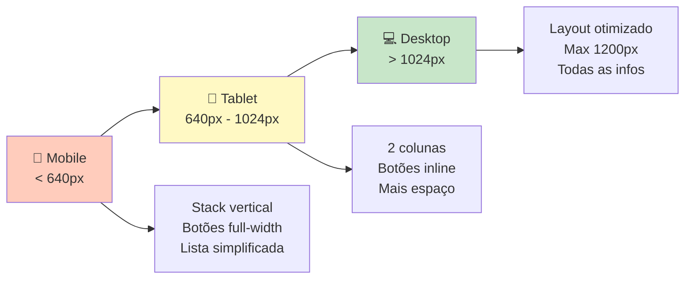

### Layout por Dispositivo

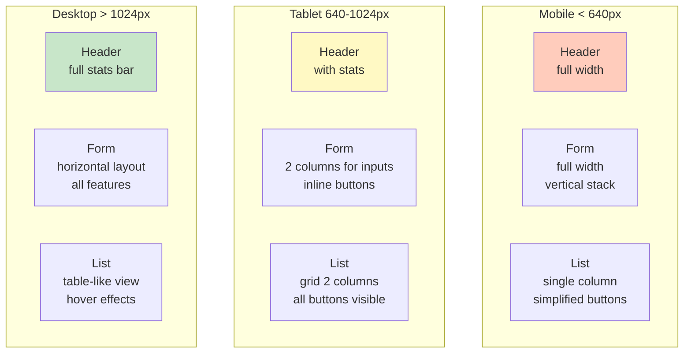

- **Mobile**: < 640px
  - Stack vertical
  - Botões full-width
  - Lista simplificada

- **Tablet**: 640px - 1024px
  - Layout em 2 colunas quando possível
  - Botões em linha

- **Desktop**: > 1024px
  - Layout otimizado
  - Máximo 1200px de largura
  - Mais informações visíveis

---

## Animações

### CSS Classes Customizadas

```css
@keyframes fade-in {
  from { opacity: 0; }
  to { opacity: 1; }
}

@keyframes slide-in {
  from { 
    transform: translateX(100%);
    opacity: 0;
  }
  to { 
    transform: translateX(0);
    opacity: 1;
  }
}

@keyframes scale-in {
  from { 
    transform: scale(0.9);
    opacity: 0;
  }
  to { 
    transform: scale(1);
    opacity: 1;
  }
}

.animate-fade-in {
  animation: fade-in 0.3s ease-out;
}

.animate-slide-in {
  animation: slide-in 0.3s ease-out;
}

.animate-scale-in {
  animation: scale-in 0.2s ease-out;
}
```

---

## Funções Utilitárias

### Fluxo de Comunicação API

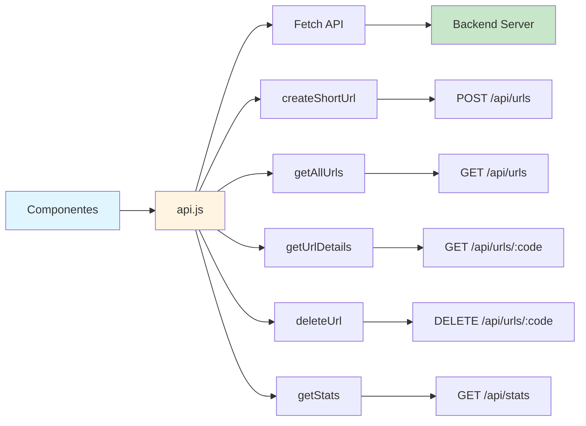

### api.js

```javascript
// Criar URL
async function createShortUrl(originalUrl, customCode = null)

// Listar URLs
async function getAllUrls(limit = 50, offset = 0)

// Obter detalhes
async function getUrlDetails(code)

// Deletar URL
async function deleteUrl(code)

// Estatísticas
async function getStats()
```

### utils.js

```javascript
// Formatar data
function formatDate(dateString)

// Truncar URL longa
function truncateUrl(url, maxLength)

// Validar URL
function isValidUrl(url)

// Copiar para clipboard
function copyToClipboard(text)

// Debounce para inputs
function debounce(func, delay)
```

---

## Acessibilidade

- Semântica HTML adequada
- Labels em todos os inputs
- Contraste de cores (WCAG AA)
- Navegação por teclado
- ARIA labels onde necessário
- Focus visível em elementos interativos

---

## Performance

### Otimizações

- Lazy loading de lista grande
- Debounce em validações
- Cache de requisições GET
- Minificação de assets
- Compressão de imagens

### Estratégia de Cache

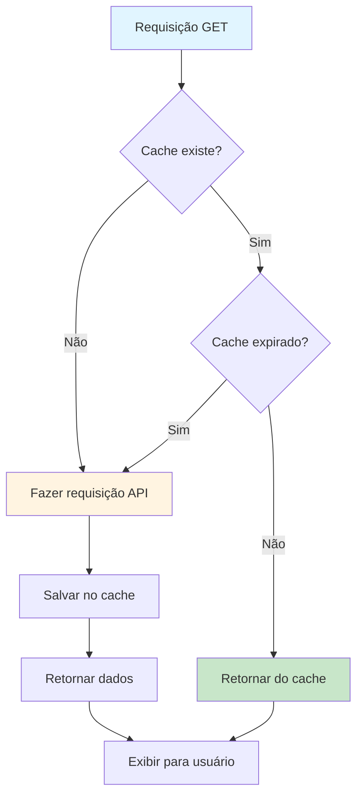

### Ciclo de Vida da Requisição

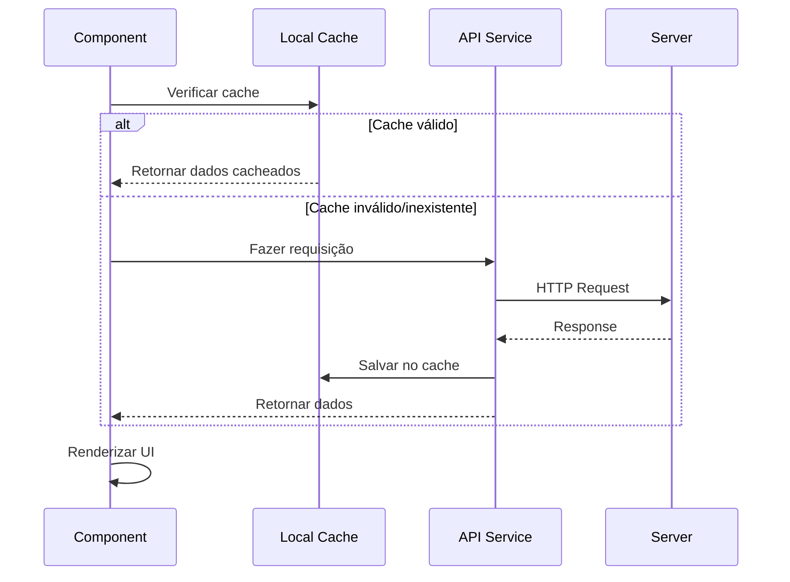

---

## Próximas Funcionalidades

- [ ] QR Code para URLs
- [ ] Gráfico de cliques ao longo do tempo
- [ ] Filtros e busca na lista
- [ ] Exportar lista como CSV
- [ ] Dark mode
- [ ] PWA (Progressive Web App)
- [ ] Compartilhamento social

### Roadmap Visual

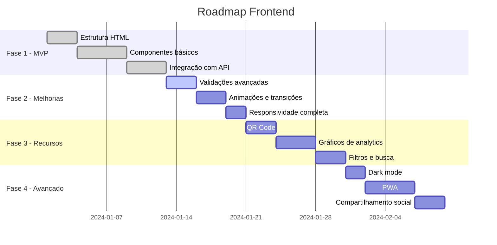

---

## Testes

### Checklist Manual

- [ ] Criar URL com código automático
- [ ] Criar URL com código personalizado
- [ ] Validação de URL inválida
- [ ] Validação de código inválido
- [ ] Copiar URL funciona
- [ ] Modal de detalhes abre e fecha
- [ ] Deletar URL com confirmação
- [ ] Responsividade em mobile
- [ ] Carregamento inicial da lista
- [ ] Toast notifications funcionam

---

## Referências

- [Tailwind CSS Documentation](https://tailwindcss.com/docs)
- [MDN Web Docs - Fetch API](https://developer.mozilla.org/en-US/docs/Web/API/Fetch_API)
- [HTML5 Semantic Elements](https://www.w3schools.com/html/html5_semantic_elements.asp)